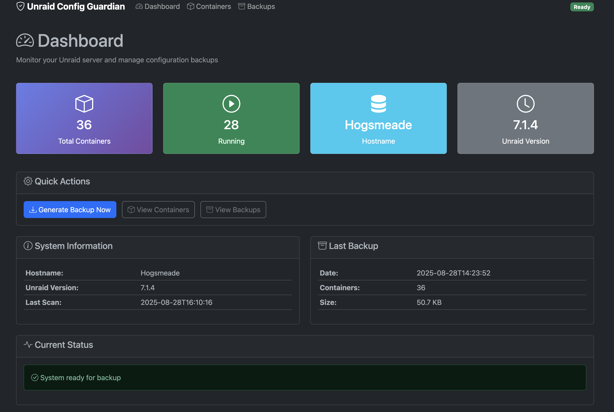
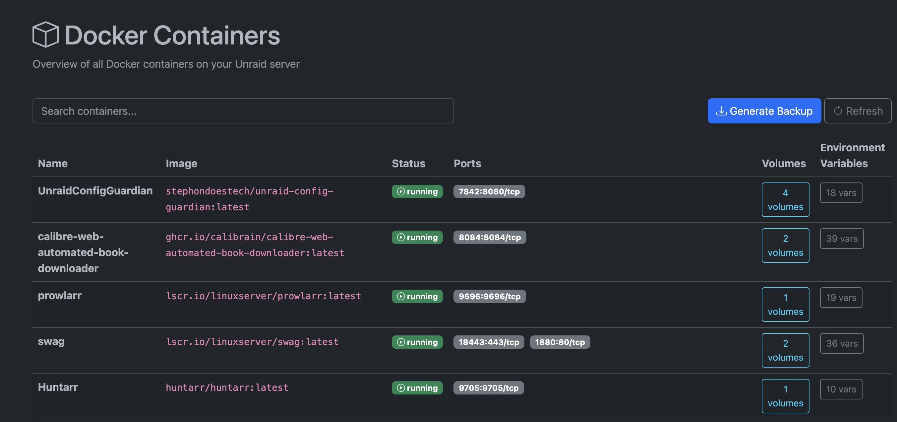

<div align="center">

# Unraid Config Guardian


[](https://github.com/stephondoestech/unraid-config-guardian/actions/workflows/ci-cd.yml)
[](https://hub.docker.com/r/stephondoestech/unraid-config-guardian)
[](https://github.com/stephondoestech/unraid-config-guardian/releases)
[](LICENSE.md)

Automatically generate comprehensive disaster recovery documentation for your Unraid setup.

</div>

**Features:**
- Complete server recreation in under 30 minutes
- Docker-compose generation from running containers
- Automated restoration scripts with security-conscious data masking

## Application

<div align="center">

### Dashboard Overview


### Container Management


</div>


## 🚀 Quick Start

### Unraid Installation (Recommended)

1. **Via Community Apps (Coming Soon):**
   - Apps → Search → "Config Guardian" → Install

2. **Manual Docker Command:**
```bash
# SSH into Unraid and run:
mkdir -p /mnt/user/appdata/unraid-config-guardian
mkdir -p /mnt/user/backups/unraid-docs

docker run -d \
  --name unraid-config-guardian \
  --restart unless-stopped \
  -p 7842:8080 \
  -v /mnt/user/appdata/unraid-config-guardian:/config \
  -v /mnt/user/backups/unraid-docs:/output \
  -v /var/run/docker.sock:/var/run/docker.sock:ro \
  -v /boot:/boot:ro \
  -e PUID=99 -e PGID=100 -e TZ=America/New_York \
  -e MASK_PASSWORDS=true \
  stephondoestech/unraid-config-guardian:latest
```

3. **Access Web Interface:** `http://your-unraid-ip:7842`

### Development Setup

```bash
# For local development
git clone https://github.com/stephondoestech/unraid-config-guardian.git
cd unraid-config-guardian
make docker-build
make docker-dev  # Access at http://localhost:7842
```

## 📦 What Gets Generated

```
unraid-backup/
├── unraid-config.json      # Complete system configuration
├── docker-compose.yml      # All containers ready for deployment
├── restore.sh             # Automated restoration script
├── README.md               # Step-by-step recovery guide
├── secrets.env.example     # Template for sensitive variables
└── system-report.html      # Visual documentation dashboard
```

## Disaster Recovery

### Quick Restore Process

1. **Install fresh Unraid** on new hardware
2. **Set up disk array** and basic configuration  
3. **Navigate to backup location:**
   ```bash
   cd /mnt/user/backups/unraid-docs/latest
   ```
4. **Run restore script:**
   ```bash
   bash restore.sh
   ```
5. **Restore your appdata** from backup
6. **Verify containers:** `docker-compose ps`

### Common Issues

- **Missing docker-compose:** Install it first
- **Permission errors:** Run `chmod +x restore.sh`
- **Container failures:** Check logs with `docker logs <container>`
- **Missing passwords:** Edit `secrets.env.example` and save as `.env`

The generated files contain everything needed to recreate your setup. Store backups offsite and test the restore process!

## ✨ Key Features

- **Complete Documentation**: Docker containers, network settings, user shares, and plugin configurations
- **Infrastructure as Code**: Generate docker-compose files and restoration scripts
- **Security**: Automatic masking of sensitive data with secure credential handling
- **Automation**: Scheduled backups with cron-based timing and notifications

## 📋 Requirements

- **Unraid 6.9+** with Community Applications plugin
- **1GB RAM** for container
- **Docker socket access** (automatic in Unraid)

## 🔧 Configuration

```bash
# Essential environment variables
PUID=99                    # Unraid user ID
PGID=100                   # Unraid group ID
TZ=America/New_York        # Timezone
SCHEDULE=0 2 * * 0         # Weekly backup (Sunday 2 AM)
MASK_PASSWORDS=true        # Hide sensitive data
```

**Container Paths:**
- `/mnt/user/appdata/unraid-config-guardian` → `/config`
- `/mnt/user/backups/unraid-docs` → `/output`
- `/var/run/docker.sock` → `/var/run/docker.sock:ro`

## 📖 Usage

### Docker Deployment
```bash
# Quick deployment
make docker-run

# Check status
make docker-logs

# Manual generation
docker exec unraid-config-guardian python3 src/unraid_config_guardian.py --output /output
```

### Local Development
```bash
# Run locally
make run

# With custom output
python src/unraid_config_guardian.py --output ./backup --debug
```

### Disaster Recovery
```bash
./restore.sh         # Run generated restoration script
docker-compose ps     # Verify services running
```

## 🛠️ Development

### Quick Start
```bash
# Clone and setup
git clone https://github.com/stephondoestech/unraid-config-guardian.git
cd unraid-config-guardian
make dev-setup
source venv/bin/activate
make install-dev
```

### Available Commands
```bash
make help          # Show all available commands
make run           # Run application locally with debug
make test          # Run test suite
make check         # Run linting, type-check, and tests
make docker-build  # Build Docker image
make docker-run    # Run with docker-compose
make clean         # Clean up generated files
```

### Development Workflow
```bash
make format        # Format code with black
make lint          # Check code style
make type-check    # Run mypy type checking
make test-cov      # Run tests with coverage
```

## 📄 License

This project is licensed under the **MIT License** - see the [LICENSE](LICENSE) file for details.

---

**Built by [Stephon Parker](https://github.com/stephondoestech) for the Unraid community**

[⭐ Star](https://github.com/stephondoestech/unraid-config-guardian/stargazers) | [🐛 Issues](https://github.com/stephondoestech/unraid-config-guardian/issues) | [💡 Features](https://github.com/stephondoestech/unraid-config-guardian/issues)
