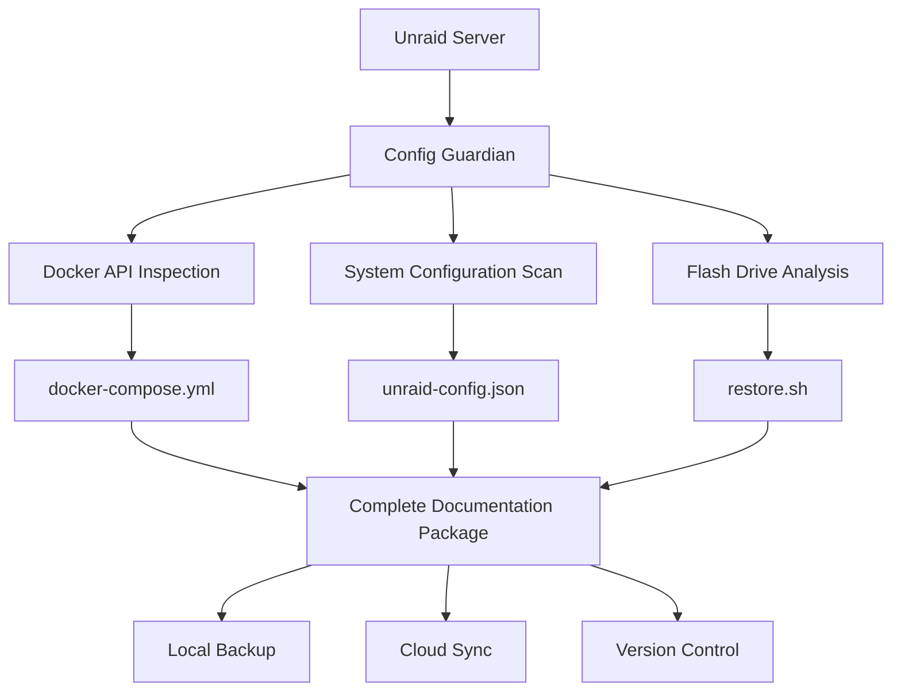

# Unraid Config Guardian

> **Python-based disaster recovery documentation for Unraid servers**

Automatically generate comprehensive Infrastructure as Code documentation for your Unraid setup, enabling complete disaster recovery in minutes instead of hours.

### TODO ADD DEMO PNG

## 🎯 What It Does

Unraid Config Guardian transforms your complex Unraid setup into organized, version-controlled documentation that enables:

- **Complete server recreation** in under 30 minutes
- **Docker-compose generation** from running containers  
- **System configuration backup** with all critical settings
- **Automated restoration scripts** for zero-guesswork recovery
- **Security-conscious documentation** with sensitive data masking

## 🚀 Quick Start

### Option 1: Docker Container (Recommended)

```bash
# Deploy on Unraid using docker-compose
curl -o docker-compose.yml https://raw.githubusercontent.com/stephondoestech/unraid-config-guardian/main/docker-compose.yml
docker-compose up -d
```

### Option 2: Unraid Community App

1. **Apps** → **Search** → "Config Guardian"
2. **Install** and configure paths
3. **Start** and access via WebUI

### Option 3: Manual Installation (Simple Start)

```bash
# SSH into your Unraid server
ssh root@tower.local  # or your server IP

# Create project directory  
mkdir -p /mnt/user/appdata/unraid-config-guardian
cd /mnt/user/appdata/unraid-config-guardian

# Download the latest release
wget https://github.com/stephondoestech/unraid-config-guardian/releases/latest/download/unraid-config-guardian.zip
unzip unraid-config-guardian.zip

# Install dependencies and run
pip install -r requirements.txt
python src/unraid_config_guardian.py
```

## 📦 What Gets Generated

```
unraid-backup/
├── unraid-config.json      # Complete system configuration
├── docker-compose.yml      # All containers ready for deployment
├── restore.sh             # Automated restoration script
├── README.md               # Step-by-step recovery guide
├── secrets.env.example     # Template for sensitive variables
└── system-report.html      # Visual documentation dashboard
```

## 🏗️ Architecture Overview



## ✨ Key Features

### **Complete System Documentation**
- All Docker containers with full configuration
- Network settings, port mappings, and volumes
- User shares, disk assignments, and array configuration
- Plugin settings and custom configurations

### **Infrastructure as Code**
- Generate docker-compose files from running containers
- Version-controlled configuration management
- GitOps-ready documentation structure
- Terraform-style declarative approach

### **Security & Privacy**
- Automatic masking of sensitive environment variables
- Secure handling of API keys and passwords
- No plain-text credential storage
- GDPR-compliant data handling

### **Automation & Scheduling**
- Automated weekly documentation updates
- Cron-based scheduling with flexible timing
- Integration with existing backup workflows
- Notification system for backup status

## 📋 Requirements

### System Requirements
- **Unraid 6.9+** (tested on 6.12+)
- **Python 3.10+** (for manual installation)
- **Community Applications** plugin installed
- **1GB RAM** available for container
- **Docker socket access** (automatically handled in Unraid)

### Unraid Specific Paths
- **Appdata:** `/mnt/user/appdata/unraid-config-guardian/`
- **Output:** `/mnt/user/backups/unraid-docs/`
- **Flash Config:** `/boot/config/` (read-only access)

## 🔧 Configuration

### Basic Environment Variables

```bash
# Essential settings for Unraid deployment
PUID=99                         # Unraid user ID (99 = nobody)
PGID=100                        # Unraid group ID (100 = users)
TZ=America/New_York            # Your timezone

# Backup scheduling
SCHEDULE=0 2 * * 0             # Weekly on Sunday at 2 AM
BACKUP_LOCATION=/output        # Container path for documentation

# Simple security
MASK_PASSWORDS=true            # Hide sensitive data (recommended)
INCLUDE_SYSTEM_INFO=true       # Include disk/network info
```

### Unraid Template Variables
When installing via Community Apps, you'll configure:
- **Host Path 1:** `/mnt/user/appdata/unraid-config-guardian` → `/config`
- **Host Path 2:** `/mnt/user/backups/unraid-docs` → `/output`  
- **Host Path 3:** `/var/run/docker.sock` → `/var/run/docker.sock:ro`

### Advanced Configuration

<details>
<summary>🔽 Click to expand advanced settings</summary>

```yaml
# config.yml - Advanced settings
guardian:
  documentation:
    include_system_logs: false
    include_performance_data: true
    generate_visual_reports: true
    
  backup:
    encryption:
      enabled: false
      key_file: /config/encryption.key
    compression:
      algorithm: gzip
      level: 6
      
  integrations:
    unraid_connect: true
    ca_backup: true
    duplicacy: false
    
  notifications:
    channels:
      - type: webhook
        url: ${NOTIFICATION_WEBHOOK}
        events: [success, error]
      - type: email
        recipients: [admin@yourdomain.com]
        events: [error]
```

</details>

## 📖 Usage Examples

### Basic Documentation Generation

```bash
# Generate documentation now
docker exec unraid-config-guardian python3 src/unraid_config_guardian.py

# Generate with custom output location
docker exec unraid-config-guardian python3 src/unraid_config_guardian.py --output /custom/path

# Generate with debug logging
docker exec unraid-config-guardian python3 src/unraid_config_guardian.py --debug
```

### Disaster Recovery Workflow

```bash
# 1. After hardware failure, install Unraid
# 2. Restore flash drive from backup
# 3. Set up basic disk configuration
# 4. Deploy from documentation
cd /path/to/backup
./restore.sh

# 5. Restore appdata from your regular backups
# 6. Verify all services are running
docker-compose ps
```

### Integration with CI/CD

```yaml
# GitHub Actions workflow
name: Unraid Backup
on:
  schedule:
    - cron: '0 2 * * 0'  # Weekly
    
jobs:
  backup:
    runs-on: self-hosted
    steps:
      - name: Generate Documentation
        run: |
          docker exec unraid-config-guardian npm run generate
          
      - name: Commit to Repository
        run: |
          git add backup/
          git commit -m "Automated backup $(date)"
          git push origin main
```


## 🧪 Testing

```bash
# Run unit tests
pytest tests/ -v

# Run with coverage
pytest tests/ -v --cov=src/ --cov-report=html

# Run linting
flake8 src/

# Run type checking
mypy src/

# Format code
black src/
```

## 🤝 Contributing

We welcome contributions! Please see our [Contributing Guide](CONTRIBUTING.md) for details.

### Development Setup

```bash
# Clone repository
git clone https://github.com/stephondoestech/unraid-config-guardian.git
cd unraid-config-guardian

# Create virtual environment
python -m venv venv
source venv/bin/activate  # On Windows: venv\Scripts\activate

# Install dependencies
pip install -r requirements.txt
pip install -r requirements-dev.txt

# Start development
python src/unraid_config_guardian.py --debug

# Run tests
pytest tests/ -v
```

### Code Style

- **Python 3.10+** with type hints
- **Black** for code formatting
- **Flake8** for linting  
- **MyPy** for type checking
- **Pytest** for testing

## 📄 License

This project is licensed under the **MIT License** - see the [LICENSE](LICENSE) file for details.

## 💼 About the Author

Built by **Stephon Parker** ([StephonDoesTech](https://github.com/stephondoestech)) - a Senior Engineering Manager who believes in applying enterprise-grade Infrastructure as Code practices to personal Unraid setups.

This tool came from real need: after rebuilding my complex Unraid setup multiple times, I wanted something that could automatically document my entire configuration for quick disaster recovery.

---

<div align="center">

**[⭐ Star this project](https://github.com/stephondoestech/unraid-config-guardian/stargazers) | [🐛 Report Bug](https://github.com/stephondoestech/unraid-config-guardian/issues) | [💡 Request Feature](https://github.com/stephondoestech/unraid-config-guardian/issues)**

*Built with ❤️ for the Unraid community*

</div>
